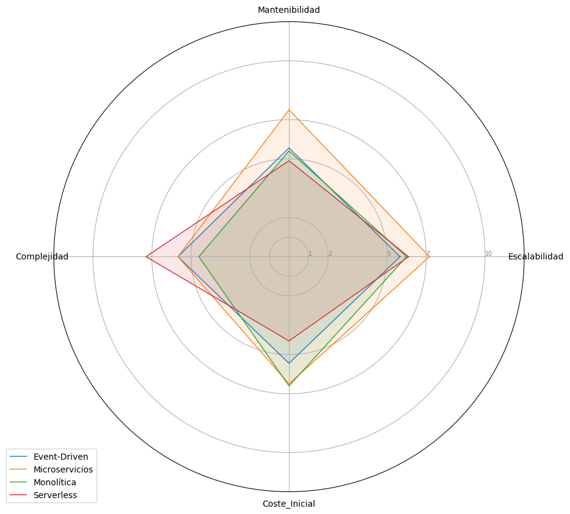

### Hipotesis: 
Cada arquitectura tiene sus fortalezas y debilidades 
### Conclusion: 
Se puede evidenciar que hay arquitecturas que tienen distintas caracteristicas pero ninguna es la mejor en todos los criterios

