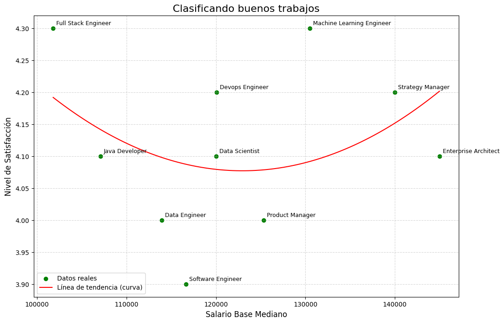

### hipotesis : 
El salario afecta la satisfaccion que tienen las personas en su puesto de trabajo
#
### conclución:
 Se entiende que al contrario de la hipotesis propuesta el salario no afecta la satisfaccion que tienen las personas en su puesto de trabajo

 