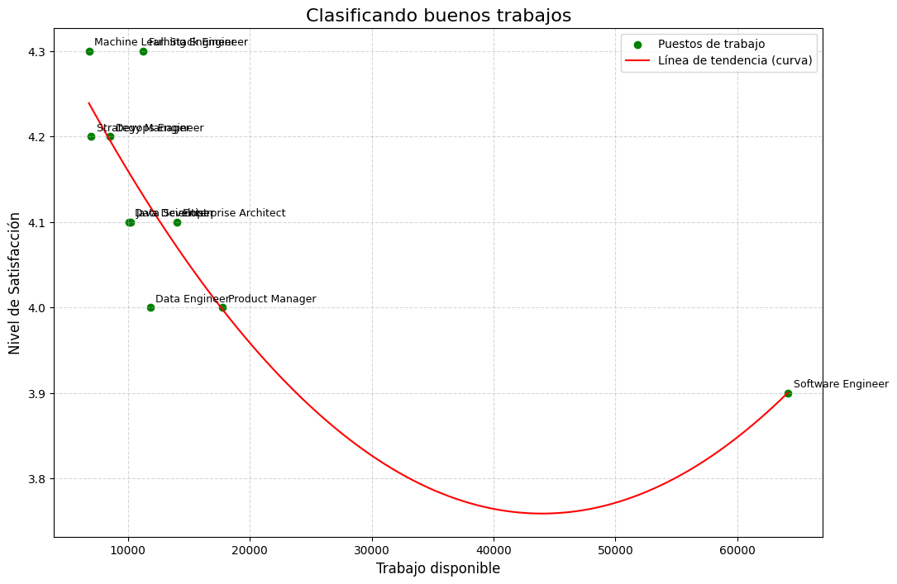

### Hipotesis:
 Los puestos de trabajo deisponibles son mayores en puesto con un nivel de satisfaccion baja
 #
### Conclusión:
 Los datos nos dice que algunos puesto no siguen esta tendencia sin embargo se puede ver que la hipotesis en solo algunos puestos podriamos decir que es una relacion no lineal 

