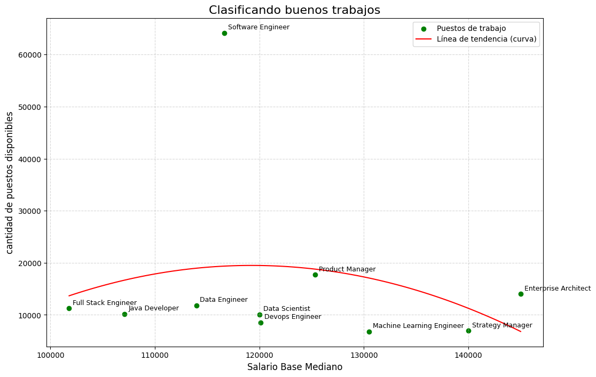

### Hipotesis:
 El trabajo con menor sueldo son los trabajo con mas puestos disponibles
#
### Conclución:
 Podemos ver que la hipotesis es incorrecta, ya alqunos trabajos con poco salario no tienen gran cantidad de puestos disponibles y se encuentra que el puesto de software engineer tiene gran cantidad de puestos sin tener un salario bajo

