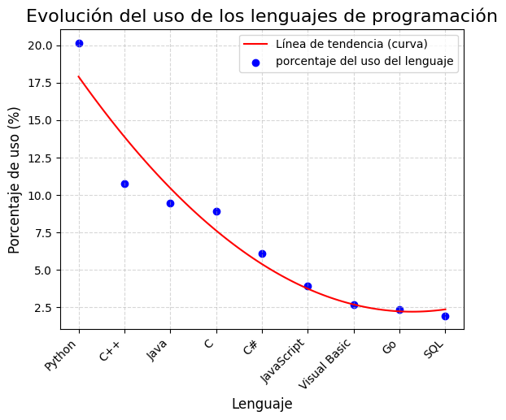

### Hipotesis: 
Se puede evidenciar gran diferencia entre el uso de python y de los demas lenguajes de programación
#
### Conclusion: 
En la grafica se puede evidenciar la diferencia del uso de cada lenguaje y se puede apreciar que python esta muy por encima de los demas lenguajes

