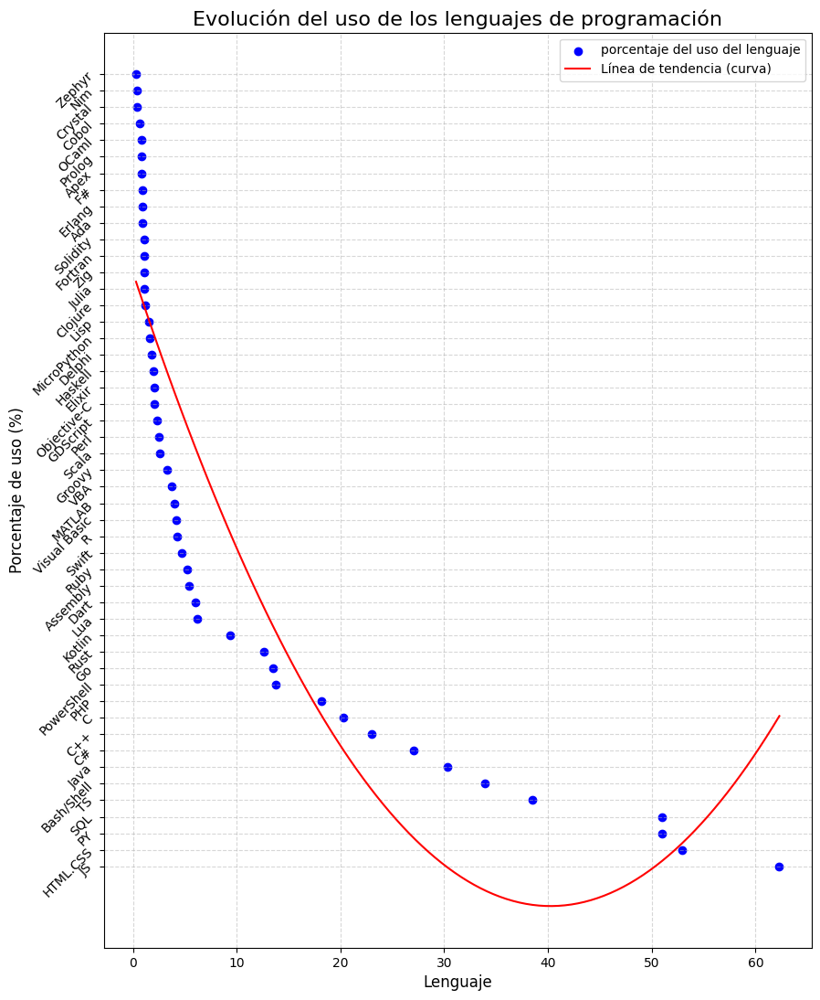

### Hipotesis: 
El porcentaje de uso de cada lenguaje de programacion no depende directamente de los demas.
#
### Conclusion: 
Se puede evidenciar que la linea de tendencia esta bastate desfazada con los datos, lo que nos permite apreciar que el porcentaje de uso de los distintos lenguaje no estan relazionados.
