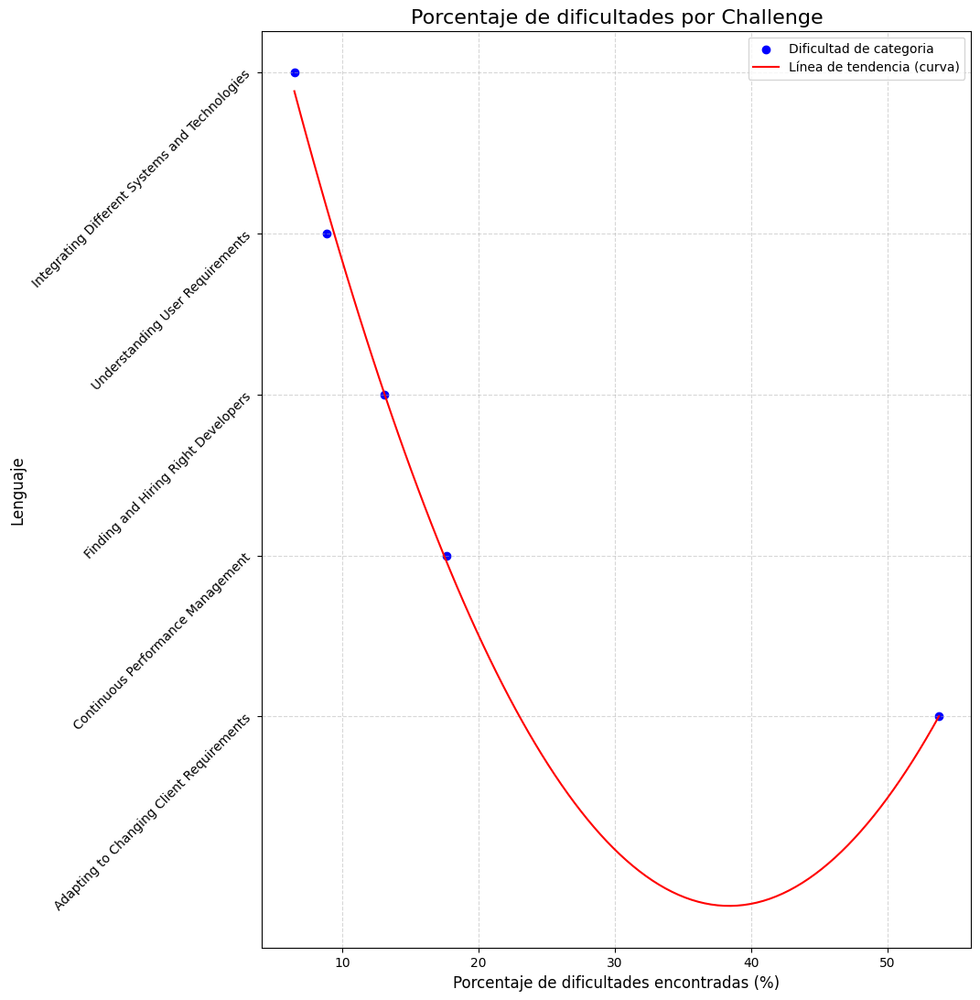

### Hipotesis: 
La mayor cantidad de problemas que presentan las empresas es la adaptacion a los cambios del cliente
#
### Conclusiones: 
En la grafica podemos ver que la adaptacion presenta una gran difucultad presentando derca del 50% de los casos son de esta problematica

