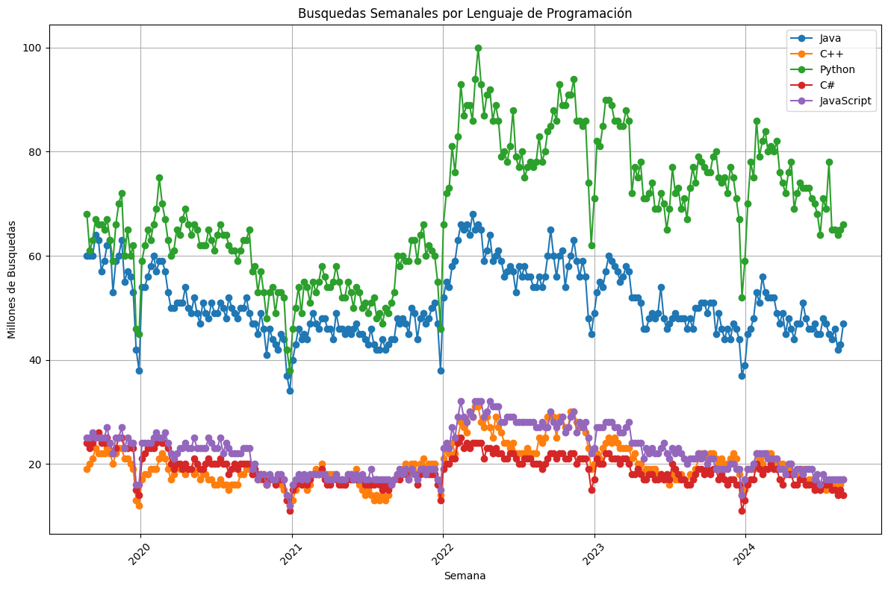
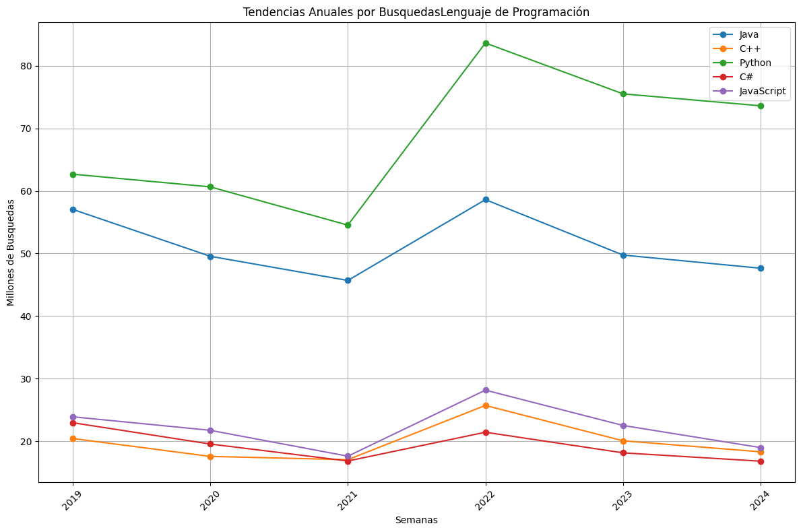
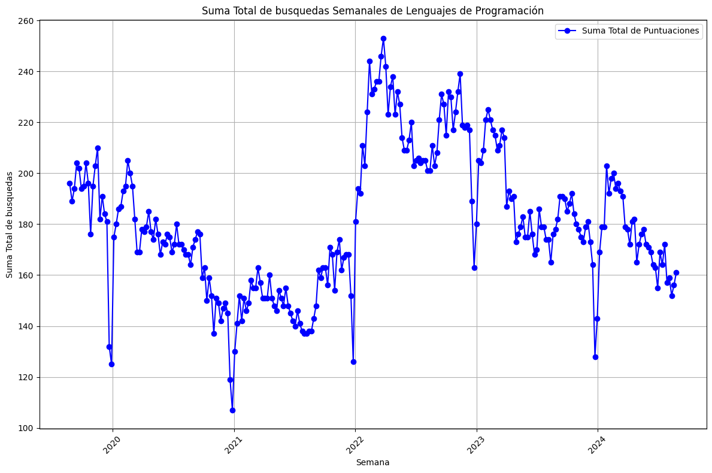
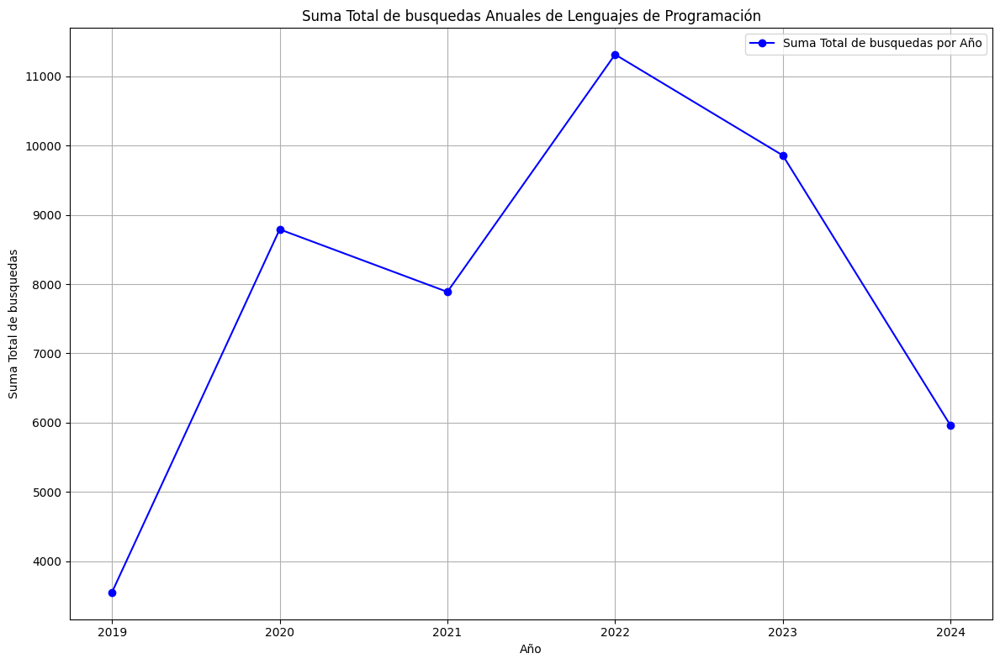

### Hipotesis: 
en el 2022 hubo un aumento en las busquedas hechas en google relacionadas a varios lenguajes de programación
#
### Conclusión:
 Se realizo el analisis de estos datos sumando las busquedas de distintos lenguajes y nos dio la respuesta que a la hipotesis la cual es correcta
#en el 2022 hubo un aumento en las  busquedas hechas en google relacionadas a varios lenguajes de programación

