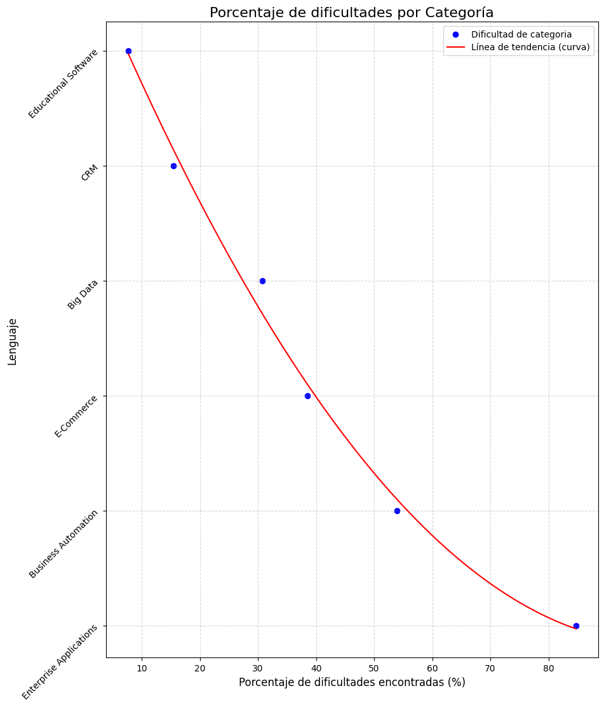

### Hipotesis:
La dificultad en el desarrollo de software varía según la categoría, siendo las aplicaciones empresariales las más desafiantes y el software educativo el menos complicado
#
### Conclucion:
la dificultad del desarrollo de software varía significativamente entre diferentes categorías, siendo las aplicaciones empresariales las más desafiantes

